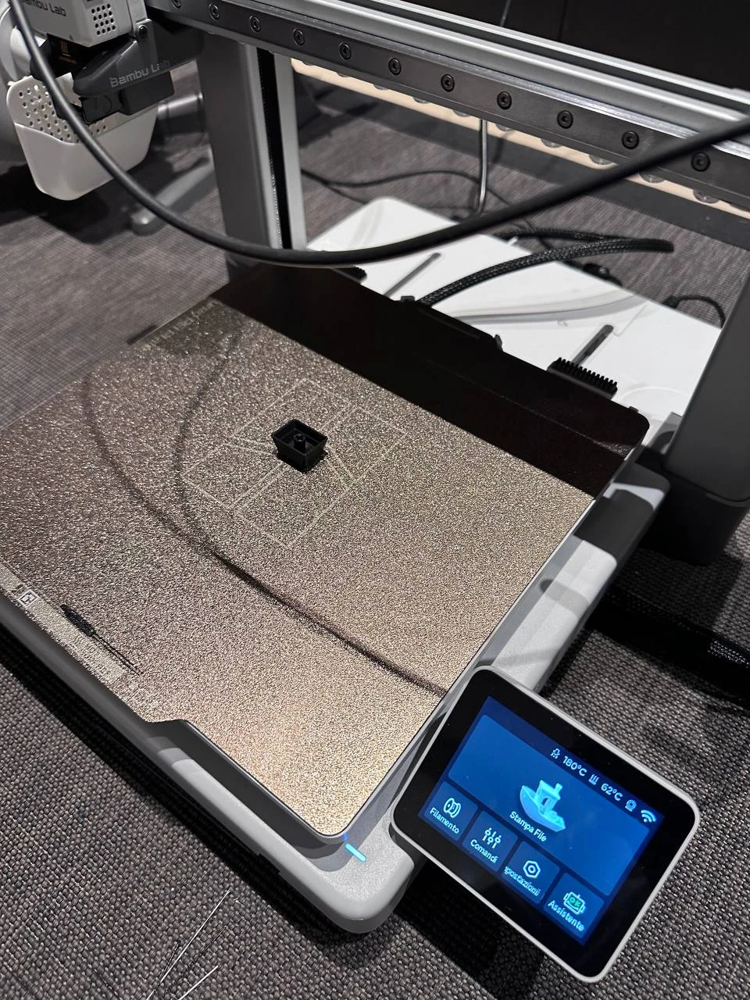

# keycaps

Replacement keycaps for mechanical keyboards, modelled parametrically in
OpenSCAD, validated geometrically before anything gets sliced, and documented
with the provenance of every single dimension.

## Why it is built this way

Replacement keycaps fail for boring reasons: a stem 0.1 mm too tight, a
stabiliser hook 0.5 mm too high, a skirt that rubs the switch housing. So the
rule here is:

* **every dimension carries a provenance tag** — `[SRC]` from a source,
  `[DER]` derived from one, `[EST]` closest standard value, `[FIT]` fit-critical
  *and* unverifiable online, so it has to be measured off the original part;
* **nothing is asserted that was not found** — if a number could not be sourced
  it is marked as an estimate, never dressed up as confirmed;
* **checks are boolean probes, not eyeballing** — a solid shaped like a real MX
  cross is pushed into the socket and the interference volume is measured;
* **the drawing is generated from the rendered solid**, and the Python tooling
  reads its dimensions back out of the render, so neither can drift from the
  model.

## Layout

```
lib/keycap_common.scad      shared geometry: shell, dish, sculpt, MX cross
                            socket, Costar hook, ribs, relief legends
tools/build_and_validate.py render + write the print-ready STL + 20 checks
tools/make_drawing.py       dimensioned 4-view drawing from the solid
tools/scadparams.py         reads ##PARAM echoes back out of a render

<keyboard>/<key>.scad       parameters + provenance for one key
<keyboard>/<key>.stl        production STL, already in print orientation
<keyboard>/<key>-drawing.*  svg / pdf / png
<keyboard>/README.md        provenance, critical dimensions, print settings
<keyboard>/VALIDATION-<key>.txt   output of the last validation run
```

## Keyboards

| keyboard | key | status |
|---|---|---|
| [`ozone-strike-battle`](ozone-strike-battle/) | left Shift — **ISO 1.25u** and ANSI 2.25u | **done** — all checks pass. ISO prints as-is; the ANSI one has one `[FIT]` dimension to measure first |
| [`asus-rog-falchion-ace`](asus-rog-falchion-ace/) | left Shift ISO 1.25u, G, ↑ — ITA layout | **done** — all checks pass; profile is estimated, nothing was measured |

## Usage

```bash
python3 tools/build_and_validate.py ozone-strike-battle/left-shift-iso.scad
python3 tools/make_drawing.py       ozone-strike-battle/left-shift-iso.scad
```

Or `make` (builds and validates everything, then the drawings).

### Requirements

* `openscad` with the manifold backend. On macOS the stable cask is disabled
  (Gatekeeper), so use the snapshot: `brew install --cask openscad@snapshot`
* Python: `trimesh manifold3d numpy rtree matplotlib`

```bash
python3 -m venv .venv && .venv/bin/pip install trimesh manifold3d numpy rtree matplotlib
```

## Printed



The first model off the plate, 2026-10-02. It sliced with no support in the
committed orientation, which is the part the geometric checks predicted.

What this photo does **not** prove is the part that matters: whether it seats
on a real switch. Until a cap has been pushed onto one, the stem clearances
are still the estimates the provenance tables say they are. See
[`photos/`](photos/) for what a print does and does not establish.

## The catalogue

**<https://allan-nava.github.io/keycaps/>** — every model with its dimensions,
its weight in PLA, its drawing and a direct STL download.

The page is generated by [`tools/make_site.py`](tools/make_site.py) from the
JSON the validator writes, so it cannot state a dimension the checks did not
measure, and it only deploys after `validate` is green.

## CI

Three workflows.

**[`validate`](.github/workflows/validate.yml)** is the merge gate. It discovers
every `<keyboard>/<key>.scad` by itself (no list to maintain), renders each one
on a matrix job and runs the full check suite, then verifies that the
**committed STL still matches the model** — which is what catches "edited the
.scad, forgot to regenerate". That last comparison is on the bounding box and
the volume, not on bytes: tessellation and font substitution differ between a
Mac and a runner, so a byte compare would be permanently red. A `repo hygiene`
job checks in parallel that every key has an STL, a validation report and a
README. On a green push to `main` the printable files go up as a single
downloadable artifact, so nobody needs OpenSCAD to get them.

**[`pages`](.github/workflows/pages.yml)** builds and publishes the
catalogue, and refuses to run when `validate` failed: publishing a keycap that
does not pass its own checks would be worse than publishing nothing.

**[`self-test`](.github/workflows/selftest.yml)** exists because a check that
cannot fail is decoration. It breaks a known-good keycap on purpose — socket
bored out, cap wider than its own pitch, walls thickened past the switch,
Costar bore under the wire diameter, socket undersized — and asserts that *the
specific check meant to catch that defect* is the one reporting FAIL, not
merely that something went wrong. It runs whenever `tools/` or `lib/` changes,
which is where a check can quietly stop working.

The drawings are byte-reproducible: matplotlib is told not to stamp a creation
date, so regenerating a drawing that did not change produces no diff, and "is
the committed artefact current" stays an answerable question.

Run both locally:

```bash
python3 tools/build_and_validate.py --check <keyboard>/<key>.scad
python3 tools/repo_lint.py
python3 tools/selftest.py
```

Ubuntu ships OpenSCAD 2021.01, which predates `--backend=manifold`, so CI
installs a dated snapshot AppImage — pinned for reproducibility, with a warned
fallback to the newest when that snapshot rotates off the server. See
[`.github/scripts/install-openscad.sh`](.github/scripts/install-openscad.sh).

## Adding a key

1. `cp ozone-strike-battle/left-shift-iso.scad <keyboard>/<key>.scad` and strip it
   back to the parameters that actually differ. With more than one key on the
   same board, put the shared parameters in `<keyboard>/profile.inc.scad` —
   files matching `*.inc.scad` are not treated as keys by the tools.
2. Override only what you know. Anything left at the library default is an
   estimate by definition — tag it `[EST]` and say so in the README.
3. Run the validator. It refuses to pass on an unimplemented stabiliser style
   rather than silently skipping the check.
4. Write `<keyboard>/README.md` with the provenance table, and list what could
   **not** be verified. That section is the point of the repo.

## Two OpenSCAD traps this repo walked into

**An included file's *variable* cannot be referenced from an assignment in the
including file.** OpenSCAD reports `Ignoring unknown variable` and leaves
`undef`, which then propagates silently through the whole model. A *function*
from the same include resolves fine, which is why per-row values are exposed as
`fa_h(row)` / `fa_tilt(row)` rather than `FA_R4_H`. Module arguments
(`text(font = fa_font())`) are evaluated later and are also fine.

**A relief legend whose outline is tangent to the stem boss's cylindrical seam
produces sliver faces and a non-manifold mesh** — clean in OpenSCAD's own
report, broken on reload. That is why `stem_top_gap` stops the boss 0.90 mm
below the top surface: the boss stays fused to the roof and its seam never
reaches the surface where a legend sits.

## Licence

[MIT](LICENSE) — the OpenSCAD sources, the Python tooling and the generated
STLs alike. Print them, sell the prints, fork the lot; just keep the notice.

**No warranty, and that matters here more than usual**: several dimensions in
every model are estimates, and each keyboard's README says exactly which ones.
Test-fit a print on a spare switch before committing to a set.

## Stabiliser styles

`lib/keycap_common.scad` implements:

* `"none"` — 1u keys and anything unstabilised.
* `"costar"` — wire stabiliser with integrated hooks, so the original white
  Costar inserts are not needed. Used by the Strike Battle.

`"cherry"` (clip-in plastic stabiliser stems, what most modern boards use) is
deliberately **not implemented**: the housing and stem dimensions have to be
measured or sourced first. A wrong stabiliser stem binds the key, so it is
better to have nothing there than a plausible guess.
